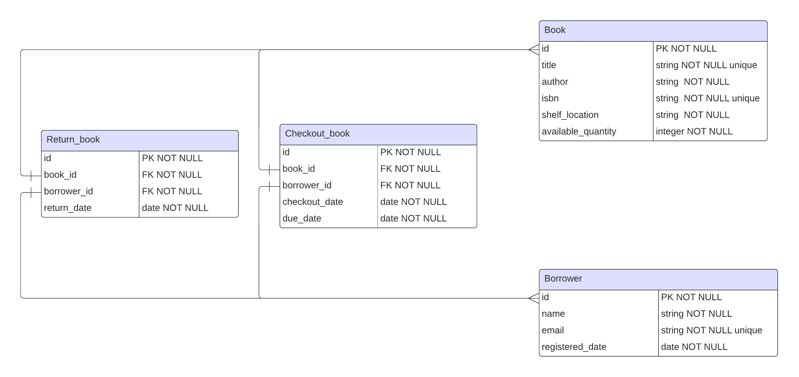

# Library-Management-System-API

## About The Project
> Library-Management-System-API is a RESTful API that tracks the borrowing process of users.

## Functionality requirements:
- Books:
    - Add a book with details like title, author, ISBN, available quantity, and shelf location.
    - Update a book’s details.
    - Delete a book.
    - List all books.
    - Search for a book by title, author, or ISBN.
- Borrowers:
    - Register a borrower with details like name, email, and registered date (Keep the  user details as simple as possible).
    - Update borrower’s details.
    - Delete a borrower.
    - List all borrowers.
- Borrowing Process:
    - A borrower can check out a book. The system should keep track of which books are
    checked out and by whom.
    - A borrower can return a book.
    - A borrower can check the books they currently have.
    - The system should keep track of due dates for the books and list books that are
    overdue.
## Built with
- Main project: [ExpressJs](https://expressjs.com), [NodeJs](https://nodejs.org)
- Database: [PostgreSQL](https://www.postgresql.org/) 
- ORM: [Sequelize](https://sequelize.org/)
- Containerization: [Docker](https://www.docker.com)

## Getting Started

> This is an list of needed instructions to set up your project locally, to get a local copy up and running follow these instructions.

## Installation

**Install docker**:

```sh
https://docs.docker.com/engine/install/
```

**_Clone the repository_**

```sh
git clone git@github.com:GeekMind00/LMS.git
```

**_Navigate to repository directory_**

```sh
$ cd lms
```  
## Project Setup

```console
docker compose up
```


## Database Schema


## Postman Use Case Examples
[Library-Management-System-API Collection](https://www.postman.com/lunar-water-612381/workspace/library-management-system)